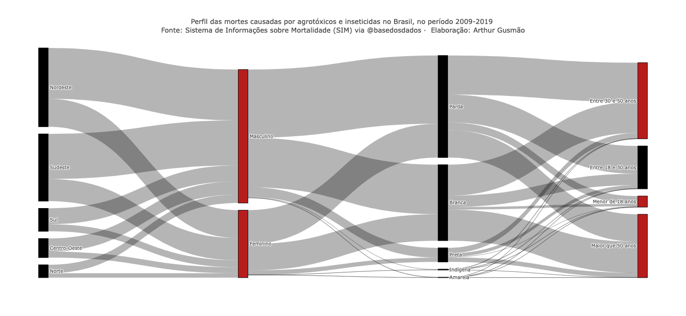
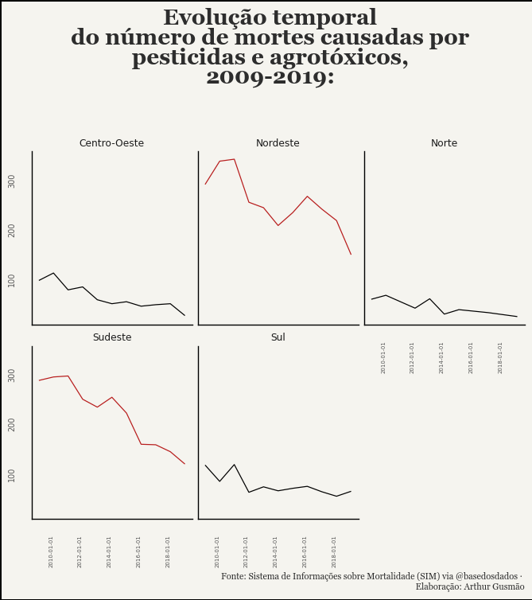

# bd_case_v2

<!-- README.md is generated from README.Rmd. Please edit that file -->

# Arthur Gusmão

## O BD Case:

###### Elaborar uma visualização, usando pelo menos uma das seguintes bases:

A base escolhida foi a do ** Sistema de Informações sobre Mortalidade (SIM) **

<!-- badges: start -->

<!-- badges: end -->

O código para as visualizações é o aaasssss
[`case_bd.ipynb`], que está presente no repositório, ele é completamente reprodutível. A
única ressalva fica para o `billing_project_id` que, no caso, contém o
meu *billing id*.

O objetivo da minha análise foi analisar o comportamento das mortes causadas por agrotóxicos e pesticidas, que podem ser identificadas no SIM. Analisei, mesmo que de forma simples, a evolução temporal e a distribuição das mortes por raça, idade, sexo e região do país. Os resultados são interessantes. 

## Primeira Visualização

## Segunda Visualização

É isso, espero que gostem :)
